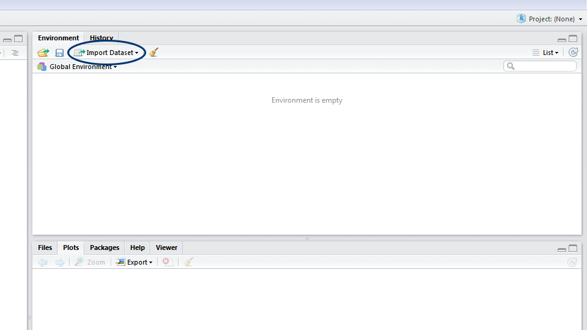
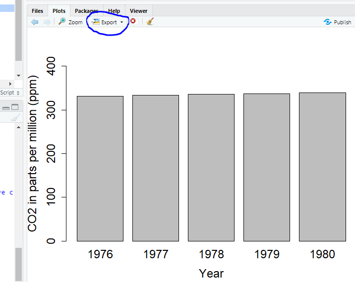
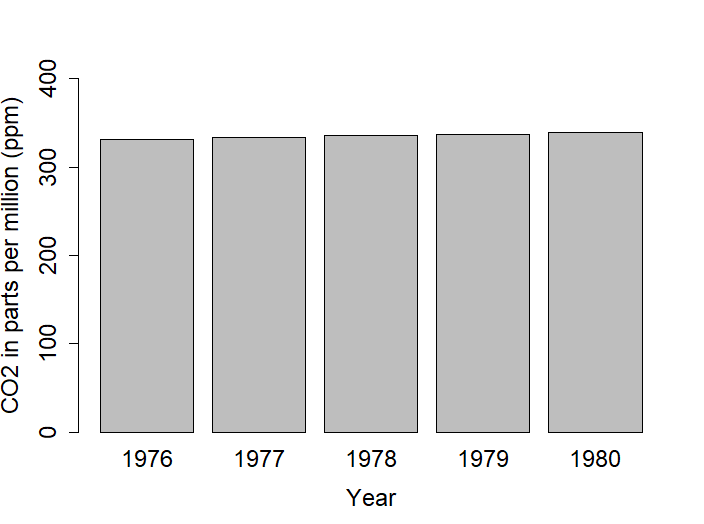

```{r setup, include=FALSE}
knitr::opts_chunk$set(message=FALSE,warning=FALSE, cache=TRUE)
```

```{r klippy, echo=FALSE, include=TRUE}
klippy::klippy()
```


*Learning goals:*

  *1.  Understand what are R and R Studio*
    
  *2.  Develop the good habit of working with scripts*
    
  *3.  Learn to import data in R*
  
  *4.  Learn to manipulate R objects like vectors and data frames*
    
  *5.  Make a simple plot*
    
<br>
    
*Steps:*

  *1.Download R and RStudio*
    
  *2.  Import and check data*
    
  *3.  Calculate yearly CO2 concentrations*
    
  *4.  Create a vector and plot it*
    
  *5.  Create a data frame and plot it*
  
<br>  
    
**Due:** Nothing at the end of lab, but be sure to save the plot I ask you to export in part 4 of this document. You will incorporate it into your final write-up for the Introduction to R lab module.  All material you need to include and questions that you must answer for final write-ups will be indicated with <mark style="color:blue">*blue text*</mark>.

<br>

### Introduction

In our first tutorial we will begin to explore “R” as a tool to analyze and visualize data.
R is a statistical programming language that has rapidly gained popularity in many scientific fields. It was developed by Ross Ihaka and Robert Gentleman as an open source implementation of the “S” programming language. (Next time you need a fun fact, you can say “Did you know that S came before R?”) R is also the name of the software that uses this language for statistical computing. With a huge online support community and dedicated packages that provide extra functionality for virtually any application and field of study, there’s hardly anything you can’t do in R.

If you already know your way around statistical software like SPSS, the main difference is that R has no **graphical user interface**, which means there are no buttons to click and no dropdown menus. R can be run entirely by typing commands into a text interface (welcome to the Matrix!). This may seem a little daunting, but it also means a whole lot more flexibility, as you are not relying on a pre-determined toolkit for your analyses.

Like with any language, there is a learning curve, but we will take it step by step, and in no time you will be coding your own analyses and graphs!

If you need any more convincing, why are we using R and not one of the many other statistical packages like MATLAB, Minitab, or even Microsoft Excel? Well, R is great because:

•  R is free and open source, and always will be! Anybody can use the code and see exactly how it works.
    
•  Because R is a programming language rather than a graphical interface, the user can easily save scripts as small text files for use in the future, or share them with collaborators.
    
•  R has a very active and helpful online community – normally a quick search is all it takes to find that somebody has already solved the problem you’re having. 

<br>

### 1. Download R and RStudio

As we said before, R itself does not have a graphical interface, but most people interact with R through graphical platforms that provide extra functionality. We will be using a program called RStudio as a graphical front-end to R, so that we can access our scripts and data, find help, and preview plots and outputs all in one place.

You can download R from [CRAN (The Comprehensive R Archive Network)](https://cran.r-project.org/). Select the link appropriate for your operating system.

Then, download RStudio from [the RStudio website](https://www.rstudio.com/products/rstudio/) (select the free open source desktop version).

Open RStudio. Click on “File/New File/R script”.


You will now see a window like the one above. You can type code directly into the console on the lower left (doesn’t mean that you should^!). Pressing enter at the end of the line runs the code (try typing 2 + 2 and running it now). You can (should!) also write your code in the script file in the top left window. To run a line of code from your script, press <mark style="background-color:grey">Ctrl+R</mark> on Windows or <mark style="background-color:grey">Cmd+Enter</mark> on a Mac. On newer Windows computers, the default shortcut is <mark style="background-color:grey">Ctrl+Enter</mark>. Or highlight the code you want to run and hit the run button (top right of the script window). The environment window gives you an overview of your current workspace^^. You will see the data you have imported, objects you have created, functions you have defined, etc. Finally, the last panel has multiple tabs and will preview your plot and allow you to navigate around folders and look at the packages you currently have installed and loaded.

^A note about scripts (We love scripts!): Remember that if you enter code directly into the console, it will not be saved by R: it runs and disappears (although you can access your last few operations by hitting the ‘up’ key on your keyboard). Instead, by typing your code into a script file, you are creating a reproducible record of your analysis. Writing your code in a script is similar to writing an essay in Word: it saves your progress and you can always pick up where you left off, or make some changes to it. (Remember to click Save (Ctrl+S) often, so that you actually save your script!)

**When writing a script, it’s useful to add comments to describe what you are doing by inserting a hasthag # in front of a line of text.** R will see anything that begins with # as text instead of code, so it will not try to run it, but the text will provide valuable information about the code for whoever is reading your script (including future you!). Like with any piece of writing, scripts benefit from structure and clarity.

^^A quicker note about the workspace: The workspace will have everything you have used in a session floating around your computer memory. When you exit, R will ask you if you want to save the current workspace. You almost [never need to](https://www.r-bloggers.com/2017/04/using-r-dont-save-your-workspace/), and it’s best to click no and start with a clear slate every time. (DO make sure you save your script though!!)

<br>

#### Begin to write in your script

For now, start by recording who is writing, the date, and the main goal – in our case, atmospheric CO2 concentrations from the Mauna Loa Observatory in Hawaii. Here’s an example, which you can copy, paste and edit into your new script:

```{r}
# DSEE – Introduction to R
# Learning how to import and explore data, and make graphs
# Modified by Prof Howard from exercise by Gergana Daskalova
```

The next few lines of code usually load the packages you will need for your analysis. A package is a bundle of commands that can be loaded into R to provide extra functionality. For example, you might load a package for formatting data, or for making maps. (Or for making graphs with [cats on them](https://github.com/Gibbsdavidl/CatterPlots), or whatever floats your boat… As we said before, there’s virtually nothing you cannot do!)

To install a package, type <mark style="background-color:grey">install.packages("package-name")</mark>. You only need to install packages once, so in this case you can type directly in the console box, rather than saving the line in your script and re-installing the package every time.  Today we will be using the <mark style="background-color:grey">dplyr</mark> [package](https://cran.r-project.org/web/packages/dplyr/index.html) to provide extra commands for formatting and manipulating data.

```{r, eval=F, echo=T}
#install package
install.packages("dplyr")
```

Once installed, you just need to load the packages using <mark style="background-color:grey">library(package-name)</mark>.  The next lines of code should define your working directory. This is a folder on your computer where R will look for data, save your plots, etc. To make your workflow easier, it is good practice to save everything related to one project in the same place, as it will save you a lot of time typing up computer paths or hunting for files that got saved R-knows-where. For instance, you could save your script and all the data for this tutorial in a folder called “Intro_to_R”. (It is good practice to avoid spaces in file names as it can sometimes confuse R.) For bigger projects, consider having a root folder with the name of the project (e.g. “My_PhD”) as your working directory, and other folders nested within to separate data, scripts, images, etc. (e.g. My_PhD/Chapter_1/data, My_PhD/Chapter_1/plots, My_PhD/Chapter_2/data, etc.).

```{r}
library(dplyr)
# Note that there are quotation marks when installing a package, but not when loading it
# and remember that hashtags let you add useful notes to your code! 

setwd("C:/Users/17163/Documents/DSEE/Labs/Intro_to_R")
# This is an example filepath, alter to your own filepath
```

To find out where your working directory is now, run the code <mark style="background-color:grey">getwd()</mark>. If you want to change it, you can use <mark style="background-color:grey">setwd()</mark>. Set your working directory to a place that makes sense to you.

Watch out! Note that on a Windows computer, a copied-and-pasted file path will have backslashes separating the folders <mark style="background-color:grey">("C:\folder\data")</mark>, but the filepath you enter into R should use forward slashes <mark style="background-color:grey">("C:/folder/data")</mark>.

<br>

### 2. Import and check data

Practice is the best way to learn any new language, so let’s jump straight in and do some of our own statistical analysis using a publicly available and very famous dataset: atmospheric CO2 concentrations at the Mauna Loa Observatory. 

You can download the dataset to your working directory and read the data into R from there. In RStudio, you can either click on the Import Dataset button and navigate to where you have saved your file, or use the <mark style="background-color:grey">read.csv()</mark> command. If you use the button, a window will pop up previewing your data. Make sure that next to Heading you have selected Yes (this tells R to treat the first row of your data as the column names) and click Import. In the console, you will see the code for your import, which includes the file path - it’s a good idea to copy this code into your script, so that for future reference you know where your dataset came from.



R works best with <mark style="background-color:grey">.csv</mark> (comma separated values) files. If you entered your data in Excel, you would need to click on Save as and select <mark style="background-color:grey">.csv</mark> as the file extension. When entering data in Excel, don’t put any spaces in your row names, as they will confuse R later (e.g. go for something like <mark style="background-color:grey">CO2_ppm</mark> rather than <mark style="background-color:grey">CO2 (ppm)</mark>. Some computers save <mark style="background-color:grey">.csv</mark> files with semicolons <mark style="background-color:grey">;</mark>, not commas <mark style="background-color:grey">,</mark> as the separators. This usually happens when English is not the first or only language on your computer. If your files are separated by semicolons, use <mark style="background-color:grey">read.csv2()</mark> instead of <mark style="background-color:grey">read.csv</mark>, or alternatively use the argument “sep” (for separator) in the <mark style="background-color:grey">read.csv</mark> function: <mark style="background-color:grey">read.csv("your-file-path", sep = ";")</mark>.

```{r, eval=F, echo=T}
MLO_CO2 <- read.csv("C:/Users/17163/Documents/DSEE/Labs/Intro_to_R/MLO_CO2.csv")  
# This is just an example that will not work for you because you have not downloaded the data.
```

Today, we will just read the data in directly from the NOAA website. The <mark style="background-color:grey">read.table()</mark> function allows you to read data in from a path on your computer or a website.

```{r}
MLO_CO2 <- read.table("https://gml.noaa.gov/aftp/data/trace_gases/co2/flask/surface/txt/co2_mlo_surface-flask_1_ccgg_month.txt") 
# This downloads data from the NOAA website.
```

Remember to save your script once in a while! If you haven’t saved it already, why not save it in the same directory as the rest of the tutorial file, and give it a meaningful name.

<mark style="background-color:lightblue">A note about objects: R is an object-based language - this means that the data you import, and any values you create later, are stored in objects that you name. The arrow </mark><mark style="background-color:grey"><-</mark><mark style="background-color:lightblue"> in the code above is how you assign objects. Here, we assigned our csv file to the object </mark><mark style="background-color:grey">MLO_CO2</mark><mark style="background-color:lightblue">. We could just as easily have called it </mark><mark style="background-color:grey">mydata</mark><mark style="background-color:lightblue"> or </mark><mark style="background-color:grey">hello</mark><mark style="background-color:lightblue"> or </mark><mark style="background-color:grey">whatever</mark><mark style="background-color:lightblue">, but it’s best to choose a unique, informative, and short name. In the top right window of RStudio, you can see the names of any objects currently loaded into R. See your </mark><mark style="background-color:grey">MLO_CO2</mark><mark style="background-color:lightblue"> object?</mark>

<mark style="background-color:lightblue">When you import your data into R, it will most likely become an object called a data frame. A data frame is like a table, or spreadsheet – it has rows and columns with the different variables and observations you have loaded. But more on that later!</mark>

A really important step is to check that your data was imported without any mistakes. It’s good practice to always run this code and check the output in the console – do you see any missing values, do the numbers/names make sense? If you go straight into analysis, you risk later finding out that R didn’t read your data correctly and having to re-do it, or worse, analyzing wrong data without noticing. To preview more than just the few first lines, you can also click on the object in your Environment panel, and it will show up as a spreadsheet in a new tab next to your open script. Large files may not display entirely, so keep in mind you could be missing rows or columns.

```{r}
head(MLO_CO2)      # Displays the first few rows
tail(MLO_CO2)        # Displays the last rows
str(MLO_CO2)         # Tells you whether the variables are continuous, integers, categorical or characters
```

<mark style="background-color:grey">str(object.name)</mark> is a great command that shows the structure of your data. So often, analyses in R go wrong because R decides that a variable is a certain type of data that it is not. For instance, you might have four study groups that you simply called “1, 2, 3, 4”, and while you know that it should be a categorical grouping variable (i.e., a factor), R might decide that this column contains numeric (numbers) or integer (whole number) data. If your study groups were called “one, two, three, four”, R might decide it’s a character variable (words or strings of words), which will not get you far if you want to compare means among groups. Bottom line: always check your data structure!

You’ll notice the variables have no names!  We can specify them with the <mark style="background-color:grey">names()</mark> function.

```{r}
names(MLO_CO2) <- c("Site","Year","Month","CO2")   
# Applies names to each variable in the dataset
```

We also used the <mark style="background-color:grey">c()</mark> function (c stands for concatenate, or chain if that makes it easier to remember). This just combines values, in this case variable names, into a vector. We will talk more about vectors later.

The dataset is composed of four variables: Site (Mauna Loa), Year, Month (of year), and CO2 concentration in ppm (parts per million).

When you want to access just one column of a data frame, you append the variable name to the object name with a dollar <mark style="background-color:grey">$</mark> sign. This syntax lets you see, modify, and/or reassign this variable.

```{r}
unique(MLO_CO2$Year) # The unique function here prints all of the unique year values in the dataset
```

```{r}
# More exploration
dim(MLO_CO2) # Displays number of rows and columns
summary(MLO_CO2) # Gives you a summary of the data
summary(MLO_CO2$CO2) # Gives you a summary of that particular variable (column) in your dataset
```

<br>

### 3. Calculate yearly CO2 averages

Our <mark style="background-color:grey">MLO_CO2</mark> object has CO2 records from 1969 through 2021, though a few years are missing. To explore these values, we will create a graph showing CO2 concentration averages for a subset of those years. You could calculate averages in Excel, but that has several disadvantages, especially when working with large datasets like ours – you have no record of what you clicked on, how you sorted the data and what you copied/deleted - mistakes can slip by without you noticing. In R, on the other hand, you have your script, so you can go back and check all the steps in your analysis.

To do this, first we need to split <mark style="background-color:grey">MLO_CO2</mark> into multiple objects, each containing rows for only one year. We do this with the useful <mark style="background-color:grey">filter()</mark> function from the <mark style="background-color:grey">dplyr</mark> package.

```{r}
Y1976 <- filter(MLO_CO2, Year == "1976")
# The first argument of the function is the data frame, the second argument is the condition you want to filter on. Because we only want the year 1969 here, we say: the variable Year MUST BE EXACTLY (==) 1969 – drop everything else from the dataset. (R is case-sensitive so it's important to watch your spelling! "year" or "Years" would not have worked here.)

Y1977 <- filter(MLO_CO2, Year == "1977")  # We do the same with 1977. It's very similar to filtering in Excel if you are used to it.
# You can create the objects for the years 1978 through 1980.
```

You need to do these steps for the years 1978 through 1980, here we have given examples for the first two. If you see an error saying <mark style="background-color:grey">R</mark> can’t find the object <mark style="background-color:grey">1969</mark> or something similar, chances are you either haven’t installed and/or loaded the <mark style="background-color:grey">dplyr</mark> package. Go back and install it using <mark style="background-color:grey">install.packages("dplyr")</mark> and then load it using <mark style="background-color:grey">library(dplyr)</mark>.

Once you have created objects for each year, we can calculate yearly averages. For this, we will use the <mark style="background-color:grey">mean()</mark> function.

```{r}
a <- mean(Y1976$CO2)
b <- mean(Y1977$CO2)
# You can choose whatever names you want for your objects, here I used a, b, c, d... for the sake of brevity.
```

```{r, eval=T, echo=F}
# producing other needed vectors, which students need to produce on their own
Y1978 <- filter(MLO_CO2, Year == "1978")
Y1979 <- filter(MLO_CO2, Year == "1979")
Y1980 <- filter(MLO_CO2, Year == "1980")


a <- mean(Y1976$CO2)
b <- mean(Y1977$CO2)
c <- mean(Y1978$CO2)
d <- mean(Y1979$CO2)
e <- mean(Y1980$CO2)
```


If you type <mark style="background-color:grey">a</mark> (or however you named your variables) in the console, what does it return? What does it mean? It should represent the year average CO2 concentration.

Again, calculate the yearly average up to 1980. You are probably noticing this is quite repetitive and uses a lot of copying and pasting! We will learn how to use more of <mark style="background-color:grey">dplyr</mark>’s functions and achieve the same result with way less code! 

<br>

### 4. Create a vector and plot it

Now that we have mean concentration by year, we can combine all those values in a vector. A vector is another type of R object that stores values. As opposed to a data frame, which has two dimensions (rows and columns), a vector only has one. When you call a column of a data frame like we did earlier with <mark style="background-color:grey">MLO_CO2$CO2</mark>, you are essentially producing a vector – but you can also create them from scratch.

We do this using the <mark style="background-color:grey">c()</mark> and <mark style="background-color:grey">names()</mark> functions again.

```{r}
CO2_y <- c(a, b, c, d, e)     # We are chaining together all the values; pay attention to the object names you have calculated and their order
names(CO2_y) <- c("1976", "1977", "1978", "1979", "1980")
```

Notice:

• The spaces in front of and behind <mark style="background-color:grey"><-</mark> and after <mark style="background-color:grey">,</mark> are added to make it easier to read the code.

• Take care to check that you are matching your vector values and labels correctly! The good thing about keeping a script is that we can go back and check that we have indeed assigned the mean of 1976 to <mark style="background-color:grey">a</mark>. Even better practice would have been to give more meaningful names to our objects, such as <mark style="background-color:grey">mean_1976</mark>.

• If you highlight a bracket  <mark style="background-color:grey">)</mark> with your mouse, R Studio will highlight its matching one in your code. Missing brackets, especially when you start nesting functions like we did earlier with <mark style="background-color:grey">length(unique())</mark> are one of the most common sources of frustration and error when you start coding!

We can now visualize CO2 concentration with the <mark style="background-color:grey">barplot()</mark> function. Plots appear in the bottom right window in RStudio.

```{r}
barplot(CO2_y)
```

Ta-daaaa! But there are a few things not quite right that we should fix – there are no axis titles, not all column labels are visible, and the CO2 values exceed the highest value on the y axis, so we need to extend it. The great thing about R is that you don’t need to come up with all the code on your own - you can use the <mark style="background-color:grey">help()</mark> function and see what arguments you need to add in. Look through the help output, what code do you need to add in?

```{r}
help(barplot)     # For help with the barplot() function
help(par)         # For help with plotting in general
```

```{r}
# The cex code increases the font size when greater than one (and decreases it when less than one).
barplot(CO2_y, xlab="Year", ylab="CO2 in parts per million (ppm)", ylim=c(0,400), cex.names= 1.5, cex.axis=1.5, cex.lab=1.5)
```

We want to <mark style="color:blue">*save our plot for the write-up*</mark>. To do this, click Export in the Plots window. If you don’t change the directory, the file will be saved in your working directory. You can adjust the dimensions to get the bar chart to look how you like it, and you should also add in a meaningful file name - <mark style="background-color:grey">Rplot01.png</mark> won’t be helpful when you try to find the file later.



<br>

Below is what the final plot should look like with a caption.  



<br>

Figure 1. Yearly atmospheric CO2 concentration (ppm) for five years (1976-1980) at the Mauna Loa Observatory, Hawaii.

<br>

### 5. Create a data frame and plot it

In the last section we created vectors, i.e., a series of values, each with a label. This object type is suitable when dealing with just one set of values. Often, however, you will have more than one variable and have multiple data types - e.g. some continuous, some categorical. In those cases, we use data frame objects. Data frames are tables of values: they have a two-dimensional structure with rows and columns, where each column can have a different data type. For instance, a column called “Wingspan” would have numeric values measured on different birds (21.3, 182.1, 25.1, 8.9), and a column “Species” would have character values of with the names of the species (“House sparrow”, “Golden eagle”, “Eurasian kingfisher”, “Ruby-throated hummingbird”). Another possible data format is a matrix - a matrix can have several rows of data as well (e.g., you can combine vectors into a matrix), but the variables must be all of the same type. For instance they are all numerical and are the same length in terms of the number of rows.

<mark style="background-color:lightblue">A note on good housekeeping: ALWAYS keep a copy of your raw data as you first collected it. The beauty of manipulating a file in an R script is that the modifications live on the script, not in the data. For Photoshop-savvy people, it’s like adding layers to an image: you’re not altering the original photo, just creating new things on top of it. That said, if you wrote a long piece of code to tidy up a large dataset and get it ready to analyze, you may not want to re-run the whole script every time you need to access the clean data. It’s therefore a good idea to save your shiny new object as a new csv file that you can load, ready-to-go, with just one command. We will now create a data frame with our CO2 concentration data, and then save it using </mark><mark style="background-color:grey">write.csv()</mark><mark style="background-color:lightblue">.</mark>

We will use the <mark style="background-color:grey">data.frame()</mark> function, but first we will create an object that contains the names of all the years (one column) and another object with the values of CO2 concentration for each year (another column).

```{r}
# Creating an object called "Year"
Year <- c("1976", "1977", "1978", "1979", "1980")

# Combining all the values for the CO2 concentrations in an object called CO2
CO2 <- c(a, b, c, d, e)

# Creating the data frame from the two vectors
CO2_year <- data.frame(Year, CO2)

# Saving the file
write.csv(CO2_year, file="CO2_year.csv")  # it will be saved in your working directory
```

If we want to create and save a barplot using the data frame, we need to slightly change the code because data frames can contain multiple variables. We need to tell R exactly which one we want it to plot. Like before, we can specify columns from a data frame using <mark style="background-color:grey">$</mark>:

```{r}
barplot(CO2_year$CO2, names.arg = c("1976","1977","1978","1979","1980"),
        ylab = "CO2 in parts per million (ppm)", xlab = "Year", ylim=c(0,400),
        cex.names= 1.5, cex.axis=1.5, cex.lab=1.5)
```

<br>

*This is the end of part 1. You have accomplished a lot:*

*1. You are familiar with the RStudio interface*
    
*2. You can create and annotate a script file*
    
*3. You can import your own datasets into RStudio*
  
*4. You can check and explore data*
    
*5. You can make simple figures*

<br>

Next week, in Part 2 we will learn how to format and manipulate data in a tidy and efficient way. More specifically, in just a few lines of code we will create a data frame with the mean CO2 concentration for ALL years in the dataset, then we will combine those data with temperature values from Mauna Loa and graph them using scatterplots!