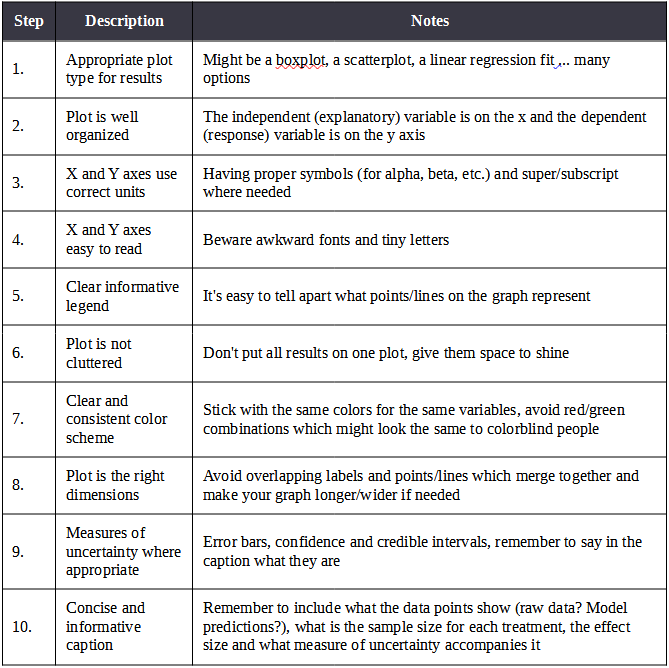
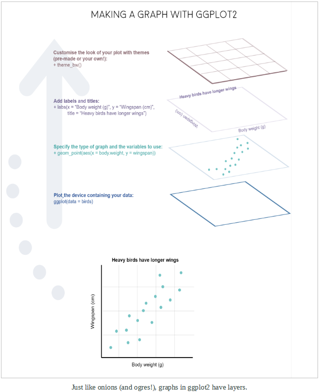
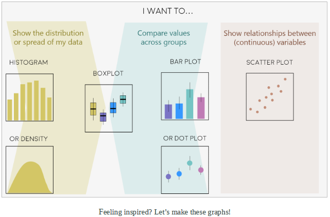
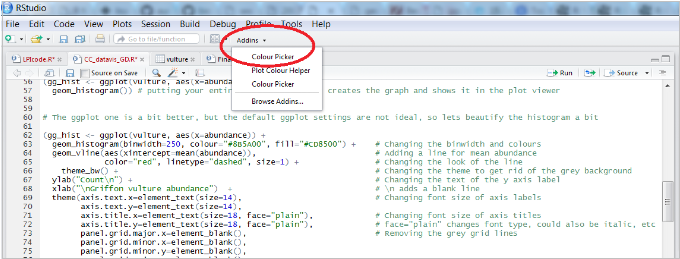
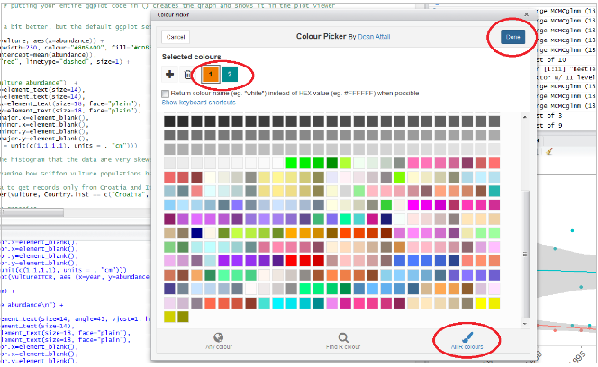

```{r setup, include=FALSE}
knitr::opts_chunk$set(message=FALSE,warning=FALSE, cache=TRUE)
```

```{r klippy, echo=FALSE, include=TRUE}
klippy::klippy()
```

*Learning goals and steps:*

*1.  Get familiar with the ggplot2 syntax*
  
*2.  Decide on the right type of plot*
  
*3.  Practice making different plots with ggplot2*

|     *-Histograms*
|     *-Scatter plots*
|     *-Box plots*
      
<br>

**Due:** Nothing this week

For the next two labs we will focus on communicating results using visualizations, or graphics.  The data we are going to use for these labs is from a paper published in 2013 on the role of biodiversity in mitigating phenological mismatches.  The [paper](https://fandm.instructure.com/courses/17827/files?preview=1433579) uses a long term dataset of bloom times for apple trees (*Malus* ssp.) and flight times for apple flower pollinators.

For part 1, there are a few bits of code and several plots that you will need to save for your write-up.  They are indicated with the *<mark style="color:blue">blue text</mark>*.

<br>

### 1. Good data visualization and ggplot2 syntax

When it comes to data visualization, the package ggplot2 by Hadley Wickham has won over many scientists’ hearts. In this tutorial, we will learn how to make beautiful and informative graphs and how to arrange them in a panel. Before we tackle the ggplot2 syntax, let’s briefly cover what good graphs have in common.



ggplot2 is a great package to guide you through those steps. The gg in ggplot2 stands for grammar of graphics. Writing the code for your graph is like constructing a sentence made up of different parts that logically follow from one another. In a more visual way, it means adding layers that take care of different elements of the plot. Your plotting workflow will therefore be something like creating an empty plot, adding a layer with your data points, then your measure of uncertainty, the axis labels, and so on.



<br>

### 2. Decide on the right type of plot

A very key part of making any data visualization is making sure that it is appropriate to your data type (e.g. discrete vs continuous), and fits your purpose, i.e. what you are trying to communicate!

You can start with our simple guide for common graph types, and visit the [R Graph Gallery](https://r-graph-gallery.com/), a fantastic resource for ggplot2 code and inspiration!



<br>

### 3. Making different plots with ggplot2

Before we make plots, let’s set up the script.  **Do not forget to annotate!!!**

```{r}
# Purpose of the script
# Your name, date and email

# Libraries - if you haven't installed them before, run the code install.packages("package_name")
library(tidyr)
library(dplyr)
library(ggplot2)
library(readr)
library(gridExtra)
```

Next, we need to get data into R.  There are three datasets provided for you on Canvas:

1) **Mid_bloom.csv** – mean mid-bloom date of apple trees by year

2) **Pollinators.csv** – data on pollinators including scientific name, date collected (Julian day of year), year collected, and corrected collection day (controlling for effect of latitude).  You should use the corrected collection day and not collection date.

3) **Climate.csv** – Has daily maximum and minimum temperature (along with other variables) for the field site from 1969 through 2010.

Get them uploaded into R (review “Introduction to R” labs for assistance).

```{r,eval=T, echo=F}
#import datasets
Mid_bloom<-read.csv("C:/Users/17163/Documents/DSEE/Labs/Apple pollinators/Mid_bloom.csv",header=T)
Climate<-read.csv("C:/Users/17163/Documents/DSEE/Labs/Apple pollinators/Climate.csv",header=T)
Pollinators<-read.csv("C:/Users/17163/Documents/DSEE/Labs/Apple pollinators/Pollinators.csv",header=T)

```

<br>

### 3a. Histograms to visualize data distribution

We are going to make a histogram of asynchrony from the Pollinator dataset, but first we need to calculate it.  Asynchrony is the difference between mid-bloom date of the apples and the collection date for the pollinators.  Collection date is an estimate of the flight period (when pollinators are out visiting plants).  The bigger the asynchrony the more phenological mismatch.

```{r}
#calculate asynchrony

#join mid bloom date with pollinators
Pollinators <- left_join(Pollinators, Mid_bloom, by = c("Year"))

#calculate asynchrony and add to the dataset using mutate
Pollinators <- Pollinators %>%
  mutate(Asynchrony = CorrectedCollectionDay - Mid_bloom_day)
```

Then, we need to filter the data so that we only keep pollinators with absolute asynchrony values less than 25 (hint: <mark style="background-color:grey">abs()</mark> is a function that produces absolute value).  We do this to avoid including pollinators that do not normally forage when the apple trees are blooming.

<mark style="color:blue">*Write the code to filter the data and include it in your write-up.*</mark>

```{r, eval=T, echo=F}
#subset only asynchrony <= 25
Pollinators <- filter(Pollinators, abs(Asynchrony) <= 25)
```


We will do a quick comparison between base R graphics and ggplot2 - of course both can make good graphs when used well, but we like working with ggplot2 because of its powerful customization abilities.

```{r}
# With base R graphics
base_hist <- hist(Pollinators$Asynchrony)
```

Using <mark style="background-color:grey">gglot()</mark>, we specify the type of graph using <mark style="background-color:grey">geom_histogram()</mark>. Note that putting your entire ggplot code in brackets () creates the graph and then shows it in the plot viewer. If you don’t have the brackets, you’ve only created the object, but haven’t visualized it. You would then have to call the object in the command line, e.g. by typing <mark style="background-color:grey">asynchrony_hist</mark> after creating the object.

```{r}
# With ggplot2: creating graph with no brackets
asynchrony_hist <- ggplot(Pollinators, aes(x = Asynchrony))  +
  geom_histogram() 
  
# Calling the object to display it in the plot viewer
asynchrony_hist

# With brackets: you create and display the graph at the same time
(asynchrony_hist <- ggplot(Pollinators, aes(x = Asynchrony))  +
  geom_histogram())
```

The default <mark style="background-color:grey">ggplot()</mark> settings are not ideal: there is lots of unnecessary gray space behind the histogram, the axis labels are quite small, and the bars blend with each other. Lets beautify the histogram a bit! This is where the true power of ggplot2 shines.

```{r}
(asynchrony_hist <- ggplot(Pollinators, aes(x = Asynchrony)) +                
  geom_histogram(binwidth = 2, color = "#8B5A00", fill = "#CD8500") +    # Changing the binwidth and colors
  geom_vline(aes(xintercept = mean(Asynchrony)),                       # Adding a line for mean abundance
             color = "red", linetype = "dashed", size=1) +           # Changing the look of the line
    theme_bw() +                                                      # Changing the theme to get rid of the gray background
  ylab("Frequency\n") +                                                   # Changing the text of the y axis label
  xlab("\nPollinator asynchrony")  +                              # \n adds a blank line between axis and text
  theme(axis.title.x = element_text(size = 14, face = "plain"),   # x axis face="plain" is the default, you can change it to italic, bold, etc. 
        axis.title.y = element_text(size = 14, face = "plain"),       # y axis 
        panel.grid = element_blank(),                                 # Removing the gray grid lines
        plot.margin = unit(c(1,1,1,1), units = , "cm")))              # Putting a 1 cm margin around the plot
```

<mark style="color:blue">*Save this plot for your Data visualization write-up.*</mark>

Note: Pressing enter after each “layer” of your plot (i.e. indenting it) prevents the code from being one gigantic line and makes it much easier to read.

<br>

### <mark style="background-color:lightblue">Understanding ggplot2’s jargon</mark>

<mark style="background-color:lightblue">Perhaps the trickiest bit when starting out with ggplot2 is understanding what type of elements are responsible for the contents (data) versus the container (general look) of your plot. Let’s de-mystify some of the common words you will encounter.</mark>

<mark style="background-color:lightblue">geom: a geometric object which defines the type of graph you are making. It reads your data in the aesthetics mapping to know which variables to use, and creates the graph accordingly. Some common types are </mark><mark style="background-color:grey">geom_point()</mark><mark style="background-color:lightblue">, </mark><mark style="background-color:grey">geom_boxplot()</mark><mark style="background-color:lightblue">, </mark><mark style="background-color:grey">geom_histogram()</mark><mark style="background-color:lightblue">, </mark><mark style="background-color:grey">geom_col()</mark><mark style="background-color:lightblue">, etc.</mark>

<mark style="background-color:lightblue">aes: short for aesthetics. Usually placed within a </mark><mark style="background-color:grey">geom_</mark><mark style="background-color:lightblue">, this is where you specify your data source and variables, AND the properties of the graph which depend on those variables. For instance, if you want all data points to be the same color, you would define the <mark style="background-color:grey">color =</mark><mark style="background-color:lightblue"> argument outside the </mark><mark style="background-color:grey">aes()</mark><mark style="background-color:lightblue"> function; if you want the data points to be colored by a factor’s levels (e.g. by site or species), you specify the </mark><mark style="background-color:grey">color =</mark><mark style="background-color:lightblue"> argument inside the </mark><mark style="background-color:grey">aes()</mark><mark style="background-color:lightblue">.</mark>

<mark style="background-color:lightblue">stat: a stat layer applies some statistical transformation to the underlying data: for instance, </mark><mark style="background-color:grey">stat_smooth(method = 'lm')</mark><mark style="background-color:lightblue"> displays a linear regression line and confidence interval ribbon on top of a scatter plot (defined with </mark><mark style="background-color:grey">geom_point()</mark><mark style="background-color:lightblue">).</mark>

<mark style="background-color:lightblue">theme: a theme is made of a set of visual parameters that control the background, borders, grid lines, axes, text size, legend position, etc. You can use [pre-defined themes, create your own](https://ourcodingclub.github.io/tutorials/data-vis-2/index.html#theme), or use a theme and overwrite only the elements you don’t like. Examples of elements within themes are </mark><mark style="background-color:grey">axis.text</mark><mark style="background-color:lightblue">, </mark><mark style="background-color:grey">panel.grid</mark><mark style="background-color:lightblue">, </mark><mark style="background-color:grey">legend.title</mark><mark style="background-color:lightblue">, and so on. You define their properties with </mark><mark style="background-color:grey">elements_...()</mark><mark style="background-color:lightblue"> functions: </mark><mark style="background-color:grey">element_blank()</mark><mark style="background-color:lightblue"> would return something empty (ideal for removing background color), while </mark><mark style="background-color:grey">element_text(size = ..., face = ..., angle = ...)</mark><mark style="background-color:lightblue"> lets you control all kinds of text properties.</mark>

<mark style="background-color:lightblue">It is also useful to remember] that layers are added on top of each other as you progress into the code, which means that elements written later may hide or overwrite previous elements.</mark>

<br>

### Learning how to use colourpicker

In the code above, you can see a color code <mark style="background-color:grey">colour = "#8B5A00"</mark> - any color you can dream of has a code, called a “hex code”, a combination of letters and numbers. You can get the codes for different colors online, from Paint, Photoshop or similar programs, or even from RStudio, which is very convenient! There is an RStudio <mark style="background-color:grey">Colourpicker</mark> addin which was a game changer for us - to install it, run the following code:

```{r, eval=F, echo=T}
# package for generating color hex codes
install.packages("colourpicker")
```

To find out the code for a color you like, click on <mark style="background-color:grey">Addins/Colour picker</mark>.



When you click on <mark style="background-color:grey">All R colours</mark> (bottom right) you will see lots of different colors you can choose from - a good color scheme makes your graph stand out, but of course, don’t go crazy with the colors. When you click on <mark style="background-color:grey">1</mark>, and then on a certain color, you fill up <mark style="background-color:grey">1</mark> with that color, same goes for <mark style="background-color:grey">2</mark>, <mark style="background-color:grey">3</mark> - you can add more colors with the <mark style="background-color:grey">+</mark>, or delete them by clicking the bin. Once you’ve made your pick, click <mark style="background-color:grey">Done</mark>. You will see a line of code <mark style="background-color:grey">c("#8B5A00", "#CD8500")</mark> appear in your script - in this case, we just need the color code, so we can copy that, and delete the rest. Try changing the color of the histogram you made just now.



<br>

### 3b. Scatter plot to examine change over time

We have taken a quick look at asynchrony, and we will come back to it.  But let’s examine some of the underlying data by making a scatterplot of pollinator collection date by time and family.

```{r}
# Make family a factor (categorical variable)
Pollinators$Family <- as.factor(Pollinators$Family)

# Using default ggplot2 graphics
(pollinator_scatter <- ggplot(Pollinators, aes(x = Year, y = CorrectedCollectionDay, color = Family)) +  
                             geom_point())
```

Hopefully by now we’ve convinced you of the perks of ggplot2, but again like with the histogram, the graph above needs a bit more work.  We are adding best fit lines, along with other features.

```{r}
# Create vector colors to be used in plot for each family
colors <-  c("#0000EE", "#8A2BE2", "#FF1493", "#CDAD00", "#548B54", "#8B5A00")

(pollinator_scatter <- ggplot(Pollinators, aes (x = Year, y = CorrectedCollectionDay, color = Family)) +
    geom_point(size = 2) +                                               # Changing point size
    geom_smooth(method = "lm", aes(fill = Family)) +               # Adding linear model fit, color-code by country
    theme_bw() +
    scale_fill_manual(values = colors) +                # Adding custom colors for solid geoms (ribbon)
    scale_color_manual(values = colors) +              # Adding custom colors for lines and points
    ylab("Collection Day\n") +                             
    xlab("\nYear")  +
    theme(axis.text.x = element_text(size = 12, angle = 45, vjust = 1, hjust = 1),     # making the years at a bit of an angle
          axis.text.y = element_text(size = 12),
          axis.title = element_text(size = 12, face = "plain"),                        
          panel.grid = element_blank(),                                   # Removing the background grid lines               
          plot.margin = unit(c(1,1,1,1), units = , "cm"),                 # Adding a 1cm margin around the plot
          legend.text = element_text(size = 12, face = "italic"),         # Setting the font for the legend text
          legend.title = element_blank(),                                 # Removing the legend title
          legend.position = c(0.87, 0.84)))                                 # Setting legend position - 0 is left/bottom, 1 is top/right
```

That’s cluttered! Can you really figure out what the families are doing? By adding a facetting layer, we can split the data in multiple facets representing the different families. This is done using <mark style="background-color:grey">facet_wrap()</mark>.

```{r}
# Create colors to be used in plot
colors <-  c("#0000EE", "#8A2BE2", "#FF1493", "#CDAD00", "#548B54", "#8B5A00")

# Plot the collection day by time for countries individually
(pollinator_scatter <- ggplot(Pollinators, aes (x = Year, y = CorrectedCollectionDay, color = Family)) +
    geom_point(size = 2) +                              # Changing point size
    geom_smooth(method = "lm", aes(fill = Family)) +    # Adding linear model fit, color-code by country
    theme_bw() +
    facet_wrap(~ Family, scales = "free_y") +           # THIS LINE CREATES THE FACETTING
    scale_fill_manual(values = colors) +                # Adding custom colors for solid geoms (ribbon)
    scale_color_manual(values = colors) +               # Adding custom colors for lines and points
    ylab("Collection Day\n") +                             
    xlab("\nYear")  +
    theme(axis.text.x = element_text(size = 12, angle = 45, vjust = 1, hjust = 1),     # making the years at a bit of an angle
          axis.text.y = element_text(size = 12),
          axis.title = element_text(size = 12, face = "plain"),                        
          panel.grid = element_blank(),                 # Removing the background grid lines               
          plot.margin = unit(c(1,1,1,1), units = , "cm"),   # Adding a 1cm margin around the plot
          legend.text = element_text(size = 12, face = "italic"),   # Setting the font for the legend text
          legend.title = element_blank(),   # Removing the legend title
          legend.position = "right"))       # Setting legend position
```

Some useful arguments to include in <mark style="background-color:grey">facet_wrap()</mark> are <mark style="background-color:grey">nrow =</mark> or <mark style="background-color:grey">ncol =</mark> , specifying the number of rows or columns, respectively. You can also see that we used <mark style="background-color:grey">scales = "free_y"</mark>, to allow different y axis values because of the wide range of abundance values in the data. You can use “fixed” when you want to constrain all axis values.

<br>

#### <mark style="background-color:#F9E59B">Good to know</mark>

<mark style="background-color:#F9E59B">If your axis labels need to contain special characters or superscript, you can get ggplot2 to plot that, too. It might require some googling regarding your specific case, but for example, this code </mark><mark style="background-color:grey">ylabs(expression(paste('Grain yield',' ','(ton.', ha^-1, ')', sep='')))</mark><mark style="background-color:#F9E59B"> will create a y axis with a label reading Grain yield (ton. ha-1).</mark>

<br>

### 3c. Boxplot to examine whether asynchrony differs between families

Box plots are very informative as they show the median and spread of your data, and allow you to quickly compare values among groups.

```{r}
# boxplot of pollinator family asynchrony
(pollinator_boxplot <- ggplot(Pollinators, aes(Family, Asynchrony)) + geom_boxplot())

# Beautifying
(pollinator_boxplot <- ggplot(Pollinators, aes(Family, Asynchrony)) + 
    geom_boxplot(aes(fill = Family)) +
    theme_bw() +
    scale_fill_manual(values = colors) +      # Adding custom colors
    scale_color_manual(values = colors) +     # Adding custom colors
    ylab("Asynchrony\n") +                             
    xlab("\nFamily")  +
    theme(axis.text = element_text(size = 12),
          axis.title = element_text(size = 12, face = "plain"),                     
          panel.grid = element_blank(),                     # Removing the background grid lines               
          plot.margin = unit(c(1,1,1,1), units = , "cm"),   # Adding a margin
          legend.position = "none"))                        # Removing legend
```

We have made several plots today!  Do any patterns you saw in the plots tell us something interesting about the relationships between plants, pollinators, and climate?

<br>

### 4. Challenge yourself!

<mark style="color:blue">*Using your new found graphing powers, I want you to make and save the following plots for your write-up:*</mark> 

|       <mark style="color:blue">*1) A fully formatted (aka beautified) plot of apple mid-bloom date by year.*</mark>

|       <mark style="color:blue">*2) A fully formatted plot of corrected collection day by pollinator genera.*</mark>