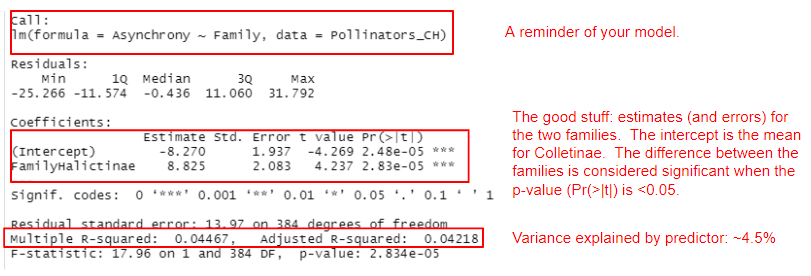
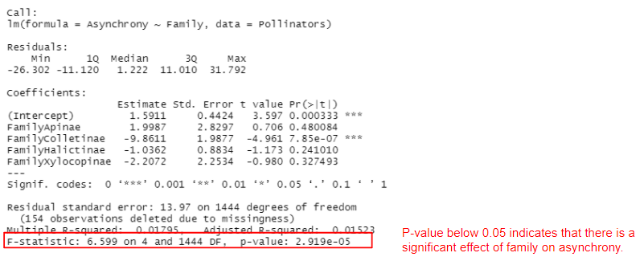
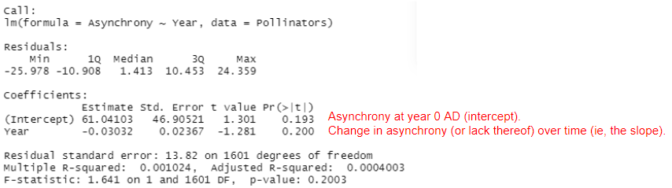
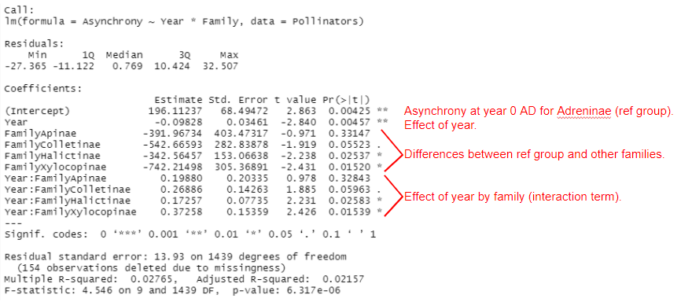
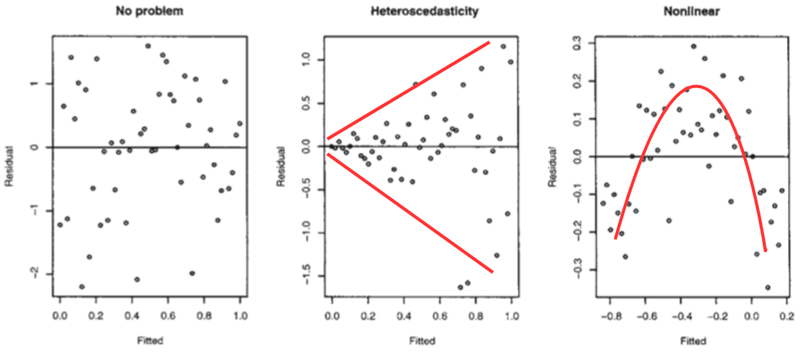
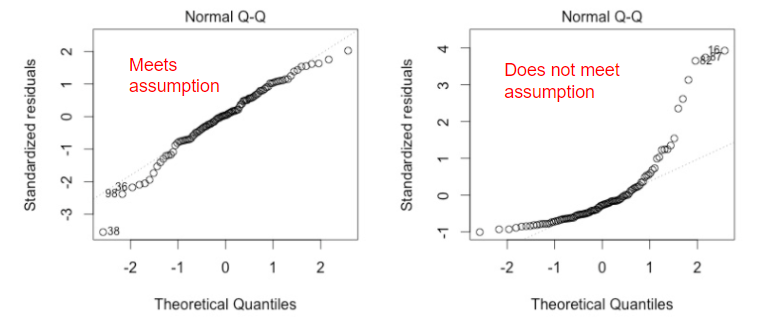
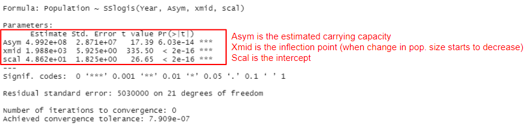

---
title: "Lab module 2 – Parts 3 and 4 (Inferential statistics)"
output:
  html_document:
    toc: true
    toc_float: true
    collapsed: false
    number_sections: false
    toc_depth: 3
    #code_folding: hide
---

```{r setup, include=FALSE}
knitr::opts_chunk$set(message=FALSE,warning=FALSE, cache=TRUE)
```

```{r klippy, echo=FALSE, include=TRUE}
klippy::klippy()
```

*Lab aims and steps:*

*1.  Introduction to linear models: t-tests and ANOVAs*
    
*2.  Introduction to linear regression (machine learning)*
    
*3.  Choosing your model structure*
    
*4.  Checking assumptions*
    
*5.  Nonlinear regression*
    
*6.  Lab write-up*

      
<br>

**Due:** lab module write-up is due 10/19 at 1:30 PM.  Details of the assignment are at the end of this document.

For the next two labs we will focus on making inferences about and predictions using our data.  We will primarily (but not exclusively) be using the datasets we used the past two labs (from the [Bartomeus paper](https://fandm.instructure.com/courses/17827/files?preview=1433579)). 

<br>

### 1. Introduction to linear models: t-tests and ANOVAs

As you are setting out to answer your research questions, often you might want to know what the effect of X on Y is, how X changes with Y, etc. To know these things, you need to run a statistical analysis. The answer to “What statistical analysis are you going to use?” will probably be a model of some sort. A model in its simplest form may look something like:

<mark style="background-color:grey">apple.m <- lm(Mid_bloom_day ~ Year, data = Mid_bloom)</mark> - i.e. we are trying to determine the effect of time (the independent, predictor, or explanatory variable) on bloom date (the dependent, or response variable). We might hypothesize that as time increases, bloom date gets earlier, which would give you a negative effect (i.e. a downward slope).

A slightly more complicated model might look like: <mark style="background-color:grey">pollinator.m <- lm(Asynchrony ~ Year + Family, data = Pollinators)</mark>. Here you are modeling Asynchrony, the response variable, as a function of Family (eg, a categorical variable describing different pollinator families) AND Year, which are both your explanatory variables. The <mark style="background-color:grey">data</mark> argument refers to the data frame in which all the variables are stored.

Confused when hearing the terms linear regression, linear model, and ANOVA? Let’s put an end to this: they’re all fundamentally the same thing!

Linear regression and linear model are complete synonyms, and we usually use these terms when we’re quantifying the effect of a continuous explanatory variable on a continuous response variable: what is the change in Y for a 1 unit change in X?

Now enters the ANOVA, which stands for Analysis of Variance. We usually talk about an ANOVA when we’re quantifying the effect of a discrete, or categorical explanatory variable on a continuous response variable.  It is also a linear model, but instead of getting a slope that allows us to predict bloom date over time, we get an estimate of a response variable for each category. A t-test is just an ANOVA with only a two-category explanatory variable.

Just to let it sink in, repeat after me: ANOVA is a linear regression (and [here](https://www.theanalysisfactor.com/why-anova-and-linear-regression-are-the-same-analysis/) is a nice article explaining the nitty gritty stuff).

We will start by exploring t-tests and ANOVAs. As always create a new script and add in your details. We will start by investigating the effect of <mark style="background-color:grey">Family</mark> on <mark style="background-color:grey">Asynchrony</mark>.

Before we run our models, it’s a good idea to visualize the data just to get an idea of what to expect. So, remake or review the boxplot of <mark style="background-color:grey">Asynchrony</mark> by <mark style="background-color:grey">Family</mark> you made previously. From looking at this boxplot alone, one might think our hypothesis of an effect of family on asynchrony is supported. Let’s run a model to explicitly test this.

<br>

### 1a. T-test

If we are interested in only comparing two families, say Colletinae and Halictinae, then we would run a t-test. Remember, a linear regression, ANOVA, and t-test are all essentially the same thing, so we run them using the <mark style="background-color:grey">lm()</mark> (stands for linear model) function. The summary function prints the results in a table.  

**Note, you need to generate the Pollinators_CH dataset referenced in the code below.  This requires you to reproduce the Pollinator dataset we used in previous labs.  This is why saving code in scripts is so useful!!**

```{r, eval=T, echo=F}
# Libraries - if you haven't installed them before, run the code install.packages("package_name")
library(tidyr)
library(dplyr)
library(ggplot2)
library(readr)
library(gridExtra)
library(lubridate) 

#import datasets
Mid_bloom<-read.csv("C:/Users/17163/Documents/DSEE/Labs/Apple pollinators/Mid_bloom.csv",header=T)
Climate<-read.csv("C:/Users/17163/Documents/DSEE/Labs/Apple pollinators/Climate.csv",header=T)
Pollinators<-read.csv("C:/Users/17163/Documents/DSEE/Labs/Apple pollinators/Pollinators.csv",header=T)


#calculate asynchrony

#join mid bloom date with pollinators
Pollinators <- left_join(Pollinators, Mid_bloom, by = c("Year"))

#calculate asynchrony and add to the dataset using mutate
Pollinators <- Pollinators %>%
  mutate(Asynchrony = CorrectedCollectionDay - Mid_bloom_day)

#subset only asynchrony <= 25
Pollinators <- filter(Pollinators, abs(Asynchrony) <= 25)

# convert "date" from chr to a Date class and specify current date format
Climate$DATE<- as.Date(Climate$DATE)

# calculate average April max temperature
April_temp<-filter(Climate,format.Date(DATE, "%m")== "04")

# create year variable
April_temp$Year<-year(April_temp$DATE)

# overwrite April_temp with yearly means
April_temp <- April_temp %>%
  group_by(Year) %>%
  summarize(Tmax = mean(TMAX, na.rm=T))

# join climate data with Mid_bloom data
Mid_bloom <- left_join(Mid_bloom, April_temp, by = c("Year"))


# filter out only Colletinae and Halictinae
Pollinators_CH <- filter(Pollinators, Family == "Colletinae" | Family == "Halictinae")
```


```{r}
pollinators.m <- lm(Asynchrony ~ Family, data = Pollinators_CH)
```

```{r, eval=F, echo=T}
summary(pollinators.m)
```


Check out the summary output of our model:



Turns out that Asynchrony does significantly differ between the two families, so we can reject the null hypothesis of no difference/ effect.

But let’s take a look at a few other things from the summary output. Notice how because Family is a factor, you get results for Halictinae. If you are looking for the Colletinae category, that is the intercept: R just picks the first category in alphabetical order and makes that one the intercept. A very important thing to understand is that the estimates for the other categories are presented relative to the reference level. So, for the Halictinae, the estimated value from the model is not 8.825, but 8.825 + -8.270 = 0.555.

You also get a Multiple R-squared value and an Adjusted R-squared value. These values refer to how much of the variation in the Asynchrony variable is explained by our predictor. The values go from 0 to 1, with 1 meaning that our model variables explain 100% of the variation in the examined variable. R-squared values tend to increase as you add more terms to your model, but you also need to be wary of overfitting. The Adjusted R-squared value takes into account how many terms your model has and how many data points are available in the response variable.

<br>

### 1b. ANOVA

What if we are interested in the effect of family overall?  Do we need to run multiple t-tests?  No, we can run an ANOVA (analysis of variance), which includes all of the families in the dataset and tests the hypothesis that there is an overall effect of family on asynchrony.

```{r}
pollinators.m <- lm(Asynchrony ~ Family, data = Pollinators)
```

```{r, eval=F, echo=T}
summary(pollinators.m)
```

Check out the summary output of our model:



Remember, that R picks the reference level alphabetically. So, the intercept represents the estimate for the Andreninae family and all other estimates are relative to the reference level.  When we use <mark style="background-color:grey">lm()</mark> to run and ANOVA, the Pr(>|t|) column examines whether or not each level is significantly different from the reference level.  What is more useful to us is the p-value on the last line of the output., which indicates that there is a significant effect of family on asynchrony.

So now, can we say this is a good model? It certainly tells us that family has a significant effect on asynchrony, but maybe not a very important one compared to other possible factors, as they only explains around 1.8% of the variation in asynchrony. Imagine all the other things that could have an impact on asynchrony that we have not examined: time, temperature, geography, etc. No matter how excited you might be to report significant effects of your variables, especially if they confirm your hypotheses, always take the time to assess your model with a critical eye!

<br>

### 2. Introduction to linear regression

So far we have examined the effect of a categorical explanatory variable.  Now, we will switch gears and examine continuous explanatory variables.  When you run a statistical test with both continuous explanatory and response variables, you are running a linear regression.

Linear regression, and really any linear model is considered to be “supervised machine learning” because your computer (machine), is determining or extracting (learning) patterns or relationships in data that is “labeled”.  Here labeled means we tell the computer (supervise) what variables to use to extract information.  In subsequent labs, we will explore “unsupervised” machine learning, where “unlabeled” data is used to cluster data (eg, cluster analysis or neural networks) or reduce dimensionality (eg, principle component analysis).  You can think of it like the computer producing variables for us instead of us providing variables to the computer.

The most common forms of linear models determine patterns in data using the least-squares method.  Where the sum of squares is minimized.  For a linear regression, this means that the best fit line (pattern) is the one that minimizes the differences between each value in the dataset and said best-fit line.  Let’s look at a cool animation of the mid bloom data to help understand this process.

```{r,eval=F, echo=T}
install.packages("animation") #download package
```

```{r,eval=F, echo=T}
require(animation) #load package into R

# data
x <- Mid_bloom$Year
y <- Mid_bloom$Mid_bloom_day

# run animation
least.squares(x,y, ylab="Mid bloom day", xlab="Year", b.range=c(-0.198,-0.187))
```

Now, let’s build our own model with the pollinator data, and test the hypothesis that asynchrony increases with time (year).

```{r}
pollinators.reg <- lm(Asynchrony ~ Year, data = Pollinators)
```

```{r, eval=F, echo=T}
summary(pollinators.reg)
```



Can you spot the difference between this model and the previous ones? In the family models, our predictor was a categorical variable. Here, our predictor is a continuous variable. For the family models, the output gave us the asynchrony estimate (mean) for each level of family (with Intercept being our reference level).

Here, the intercept is the value of Y when X is 0. In many models this is not of interest and sometimes doesn’t make a ton of sense.  In our case, it would be asynchrony in the year 0. Then, the output gives us an estimate, which is the slope of the relationship. In this case, every additional year of time there is an average decrease of 0.03 days in asynchrony. You probably remember how to write linear equations from school, so that you could write it as: asynchrony = 61 - 0.03*(Year).

So far, so good? Hold your horses! The p-value is above 0.05, therefore the slope of Year is not significantly different from zero.  In other words, asynchrony does not change with time.  This is consistent with the very low R^2 of 0.1%.

What if we include the effect of family in the model, as well? Let’s run a new model to test this:

```{r}
pollinators.reg <- lm(Asynchrony ~ Year*Family, data = Pollinators)
```

```{r, eval=F, echo=T}
summary(pollinators.reg)
```

Can you make sense of the output? Take a moment to examine yours and try to work it out. It is a bit tricky because it include both continuous and categorical explanatory variables (this is called an ANCOVA).  For instance, could you calculate the estimated asynchrony of Xylocopinae in the year 1970?



Let’s write the equation.  To do this, we are modifying the intercepts and slopes according the family and year.

Note, for both Xylocopinae (and other families) there is a significant interaction term, meaning that asynchrony changes significantly over time that family.  It always makes a lot more sense when you can visualize the relationship.  So I suggest looking at the appropriate plot (hint: you’ve already made something very similar in a previous lab!).

For Xylocopinae, in the year 1970:

asynchrony = 196.11 + -742.21 + -0.098x(Year)  + 0.37258x(year). The asynchrony in 1970 would be 196.11 + -742.21 + -0.098x(1970)  + 0.37258x(1970) = -5.1774 days.

Let's try another example.  For Halictinae in the year 2010, it would be: 

asynchrony = 196.11 + -342.56 + -0.098x(Year)  + 0.17257x(year). The asynchrony in 2010 would be 196.11 + -342.56 + -0.098x(2010)  + 0.17257x(2010) = 3.4257 days.

<br>

### 3. Choosing your model structure

Another important aspect of modeling to consider is how many terms, i.e. explanatory variables, you want your model to include. It’s a good idea to draft out your model structure before you even open your R session. Let your hypotheses guide you! Think about what it is you want to examine and what the potential confounding variables are, i.e. what else might influence your response variable, aside from the explanatory variable you are most interested in? Here is an example model structure from before:

**You do not have to run any of the code within this section.  It is include for demonstration purposes.**

```{r, eval=F, echo=T}
pollinators.reg <- lm(Asynchrony ~ Year + Family, data = Pollinators)
```

Here we are chiefly interested in the effect of time (Year): does asynchrony change over time? This is the research question we might have set out to answer, but we still need to acknowledge that time is probably not the only thing out there influencing phenology. Based on our ecological understanding, we can select other variables we may want to control for. For example, the insect family a pollinator belongs to may influence phenology, so we need to account for that.

But wait - surely phenology depends on where the pollinators occur. Thus, let’s add latitude + longitude to the model.

```{r, eval=F, echo=T}
pollinators.reg <- lm(Asynchrony ~ Year + Family + Latitude + Longitude, data = Pollinators)
```

Last, imagine your read a paper indicating that precipitation significantly influences some pollinator flight dates. Ignoring this would weaken your final results - is Asynchrony different / the same because time has no / an effect, or because there was variance in rain? To test that, you can include a PRCP term in your model.

```{r, eval=F, echo=T}
pollinators.reg <- lm(Asynchrony ~ Year + Family + Latitude + Longitude + PRCP, data = Pollinators)
```

Some might say this model is very complex, and they would be right - there are a lot of terms in it! A simple model is usually preferred to a complex model, but if you have strong reasons for including a term in your model, then it should be there (whether it ends up having an effect or not). Once you have carefully selected the variables whose effects you need to quantify or account for, you can move onto running your models.

<br>

#### <mark style="background-color:#F9E59B">Don’t go over the top!</mark>

<mark style="background-color:#F9E59B">It is important to be aware of the multiple factors that may influence your response variables, but if your model has a lot of variables, you are also in danger of overfitting. This means that there is simply not enough variation in your dataset (often because it is too small) to be accounted by all those variables, and your model will end up being super tailored to this specific dataset, but not necessarily representative of the generalized process or relationship you are trying to describe. Overfitting can cast doubt over your model’s output, so think carefully about the structure of your model, and read more about how to detect and avoid overfitting [here](https://statisticsbyjim.com/regression/overfitting-regression-models/).</mark>

<mark style="background-color:#F9E59B">Another thing to think about is collinearity among your explanatory variables. If two variables in your dataset are very correlated with each other (eg, temperature and time), chances are they will both explain similar amounts of variation in your response variable - but the same variation, not different or complementary aspects of it! Imagine that you measured tree heights as you walked up a mountain, and at each measuring point you recorded your elevation and the air temperature. As you may expect that air temperature goes down with increasing elevation, including both these factors as explanatory variables may be risky.</mark>

<br>

### 4. Checking assumptions

In addition to checking whether a model makes sense from an ecological perspective, we should check that it actually meets the assumptions of a linear model:

1- are the residuals, which describe the difference between the observed and predicted value of the dependent variable, normally distributed?

2- are the data homoscedastic? (i.e. is the variance in the data approximately the same at all values of the predictor variable)

3- is there a linear relationship between x and y?

4-are the observations independent?

There are statistical tests out there to examine these assumptions, such as the Shapiro-Wilk test for normality, and the Bartlett test for homoscedasticity.  However, I prefer to look at diagnostic plots.  

```{r, eval=F, echo=T}
plot(pollinators.reg)  # you will have to press Enter in the command line to view the plots
```

This will produce a set of four plots.  However you really only need to look at the first two:

-  Residuals versus fitted (predicted) values. This plot assesses whether or not you have issues with variance or linearity.  Here are some examples:



-  Q-Q plot of standardized residuals. This plot examines the normality assumption. If the values fall near the dotted line, then the assumption is met. If the values deviate severely, then the assumption is not met.



<mark style="background-color:#F9E59B">We do not typically test for independence of data points.  We design our experiment so that they are independent, making no test required.</mark>

<br>

### 5. Non-simple linear regression

In the linear regressions we have explored so far, we have assumed a simple straight line relationship between the explanatory and response variables.  However, not all relationship follow a straight line.  Two examples that we saw from class are exponential and logistic growth.  Historically, one solution for non-simple linear relationships was to transform the data (eg, log-transformation).  However, that makes interpretation of the results difficult.  It is a mental load to think about log-growth versus just growth.  With the computing power that we have today, we can analyze the data without transforming it. 

<br>

### 5a. Logistic growth model

Import the US_pop.csv dataset (it is available on Canvas).  It is the US population size at every census going back to its founding. Instead of using <mark style="background-color:grey">lm()</mark> we are using <mark style="background-color:grey">nls</mark>, which stands for nonlinear least squares.  We also specify that we are estimating a logistic growth curve with <mark style="background-color:grey">SSlogis()</mark>. The logisitic growth equation requires three parameters be estimated: Asym (carrying capacity), xmid (inflection point), and scal (intercept).

```{r, eval=T, echo=T}
#import dataset
US_pop<-read.csv("C:/Users/17163/Documents/DSEE/Labs/Apple pollinators/US_pop.csv",header=T)

#run logistic growth regression
LG.mod <- nls(Population ~ SSlogis(Year, Asym, xmid, scal), data= US_pop)
```
```{r, eval=F, echo=T}
#print results
summary(LG.mod)
```


From the summary output we can see that the estimated carrying capacity for the US population is nearly 500 million people!  Why may this be higher than values from more sophisticated models, like the chohort-component projection?

It is probably a good idea to visualize these results.  Let’s start with a simple plot showing the population values and best-fit line.

```{r}
#load ggplot2 before making plot
require(ggplot2)

(LG_plot <- ggplot(US_pop, aes(x = Year, y = Population)) +
    geom_point(size = 3, color = "blue") +
    geom_line(aes(x = US_pop$Year, y = predict(LG.mod)), size = 1.25, alpha = 0.5) +
    theme_bw() +
    theme(axis.text.x = element_text(size = 12, angle = 45, vjust = 1, hjust = 1),
          axis.text.y = element_text(size = 12),
          axis.title = element_text(size = 12, face = "plain"),                        
          panel.grid = element_blank(),                                                 
          plot.margin = unit(c(1,1,1,1), units = , "cm"))
)
```

What good is a model like this if we do not make predictions?! This is where a prediction interval comes in.  Regressions can project future response variable outcomes simply by plugging values for explanatory variables into the best-fit line equation (eg, the asynchrony examples above).  However, you also need to quantify the uncertainty in your prediction with prediction intervals.  You have all used confidence intervals before, but prediction intervals are a little different.  Confidence intervals quantify variation in a mean or best-fit line due to sampling error.  Whereas, prediction intervals incorporate sampling error AND uncertainty in future values.  When you are predicting a future value, you are predicting a single value, not a mean.  So, your interval must include sampling error and the uncertainty of any one possible future outcome.

Now let’s produce predictions for the decadal censuses through 2100.

```{r,eval=F, echo=T}
# propagate package is required to produce predicted values for nls
install.packages("propagate")
```

```{r}
require(propagate)

# this produces a dataframe of years when pop. size will be predicted
pred_data <- data.frame(Year = c(seq(2020,2100,10)))

# generates 95% prediction intervals
pred_pop <- predictNLS(LG.mod, newdata=pred_data, interval="prediction", alpha=0.05)

# a dataframe of the predicted values (from best-fit line) and prediction intervals
pred_pop <- data.frame(pred_pop$summary$Sim.Mean,pred_pop$summary[,11],pred_pop$summary[,12], pred_data$Year)
names(pred_pop) <- c("Population", "lwr", "upr", "Year")
```

Next, we can include the prediction intervals to our plot by adding <mark style="background-color:grey">geom_ribbon()</mark> and <mark style="background-color:grey">geom_line()</mark> layers.

```{r}
(LG_plot <- ggplot(US_pop, aes(x = Year, y = Population)) +
    geom_point(size = 3, color = "blue") +
    geom_line(aes(x = US_pop$Year, y = predict(LG.mod)), size = 1.25, alpha = 0.5) + 
    geom_line(data = pred_pop, aes(x = Year, y = Population), size = 1.25, alpha = 0.5) + # prediction (from best-fit line)
    geom_ribbon(data=pred_pop, aes(ymin = lwr, ymax = upr), fill = "blue", alpha = 0.2) + # prediction interval
    theme_bw() +
    theme(axis.text.x = element_text(size = 12, angle = 45, vjust = 1, hjust = 1),
          axis.text.y = element_text(size = 12),
          axis.title = element_text(size = 12, face = "plain"),                        
          panel.grid = element_blank(),                                                 
          plot.margin = unit(c(1,1,1,1), units = , "cm"))
)
```

Notice that as our prediction moves father away from the existing data the intervals get larger.  This is because uncertainty in future values increases as we move further away from established values in the dataset.  This logistic model suggests that the US will not reach its carrying capacity by 2100.  Do you agree with this prediction?

<br>

### <mark style="color:blue">*6. Assignment*</mark>

<mark style="color:blue">*Your lab write-up for module 2 is a results and discussion section.  This can either be in the form of a scientific paper, or data driven blog post.  In this course, we have almost exclusively read scientific papers, but one lofty goal of data science is to clearly communicate interesting and potentially complex results to non-scientists.*</mark>

<br>

#### <mark style="color:blue">*Detailed expectations:*</mark>

<mark style="color:blue">*Due: Wednesday, 10/19 at 1:30 PM, Points: 40 pts.*</mark>

<mark style="color:blue">*Your write-up should:*</mark>

<mark style="color:blue">*1) Address the following question:*</mark>

<mark style="color:blue">*-  Is there phenological mismatch between apple (Malus ssp.) flowers and their pollinators.*</mark>  
	
<mark style="color:blue">2) Include all the plots you saved from the data visualization labs, and at least one additional plot that includes prediction intervals.</mark>

<mark style="color:blue">*-  If you are writing a scientific paper, the plots need captions.*</mark>

<mark style="color:blue">*-  If you are writing a blog post, the plots need titles.*</mark>

<mark style="color:blue">*3) Include any statistical results that are required to assess patterns or relationships shown in plots.*</mark>

<mark style="color:blue">*-  If you are writing a scientific paper, the statistical results should be provided parenthetically (remember back to BIO 110!).*</mark>

<mark style="color:blue">*-  If you are writing a blog post, they can be included as endnotes.*</mark>

<mark style="color:blue">*-  I don’t really care about formatting details.  Use whatever citation type you want.*</mark>

<mark style="color:blue">*4) Include a discussion section that addresses the question given above and associated hypotheses and makes some predictions about the ecological future of both the pollinators and apple trees.  You do not need to address the literature at large, discuss weaknesses in the experiment, or provide future directions.*</mark>

<mark style="color:blue">*5) Include any code I asked you to save from previous labs. Include it as an appendix.*</mark>

<mark style="color:blue">*A few additional things:*</mark>

<mark style="color:blue">*You may use the published paper (cited at the start of this lab document) as a guide (no reference section is required), but note that many of its figures are quite bad, visually.*</mark>

<mark style="color:blue">*For data driven blog post examples, you should look at [FiveThirtyEight](https://fivethirtyeight.com/) (Nate Silver is my statistical hero!), like the [Ukraine article](https://fandm.instructure.com/courses/17827/files/folder/Readings?preview=1470282), the [NY Times The Upshot](https://www.nytimes.com/section/upshot), or The American Scientist ([Budburst article](https://fandm.instructure.com/courses/17827/files/folder/Readings?preview=1470284) example).*</mark>

<br>

#### Additional Prediction Interval Code

Below is example code for generating prediction intervals using <mark style="background-color:grey">lm()</mark>.

```{r}
# run model
bloom.lm<-lm(Mid_bloom_day~Year, data = Mid_bloom)

# create new data for predictions
newdata<-as.data.frame(c(2011:2050))
names(newdata)<-c("Year")

# predict new values
pred_vals<-predict(bloom.lm,newdata,interval= "predict")

# create dataframe of new data with prediction values
pred_data<-data.frame(pred_vals,newdata)
names(pred_data)<- c("Mid_bloom_day","lwr","upr","Year")

# make plot
(LG_plot <- ggplot(Mid_bloom, aes(x = Year, y = Mid_bloom_day)) +
geom_point(size = 3, color = "blue") +
geom_line(aes(x = Mid_bloom$Year, y = predict(bloom.lm)), size = 1.25, alpha = 0.5) + 
geom_line(data = pred_data, aes(x = Year, y = Mid_bloom_day), size = 1.25, alpha = 0.5) + # prediction (from best-fit line)
geom_ribbon(data = pred_data, aes(ymin = lwr, ymax = upr), fill = "blue", alpha = 0.2) + # prediction interval
theme_bw() +
    theme(axis.text.x = element_text(size = 12, angle = 45, vjust = 1, hjust = 1),
     axis.text.y = element_text(size = 12),
     axis.title = element_text(size = 12, face = "plain"),
     panel.grid = element_blank(), 
     plot.margin = unit(c(1,1,1,1), units = , "cm"))
)
```

