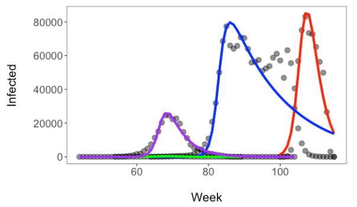

# **Lab Documents**

## How to use

1. This site is the source of your DSEE lab documents.  It is a resource additional to those found on Canvas.
2. You can find the appropriate document for each lab in the menu above.
3. Additional information can be found on the course Canvas site.
4. If you have additional questions outside of class email me at: ahoward@fandm.edu

### [Data Science for Ecology and the Environment](https://fandm.instructure.com/courses/17827)

Figure: Example of a plot you will create in the Data modeling and disease ecology module.  Observed and estimated (lines) number of individuals infected with four covid variants (x-axis is weeks after first sequenced variant).  Estimates are based on SIR model.

</a>

